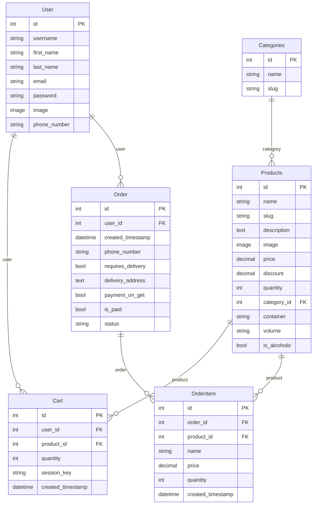

# Техническое описание проекта: Интернет-магазин завода напитков "Абдыш-Ата"

> Документ предназначен для использования в выпускной квалификационной работе (ВКР).
> Содержит полное описание архитектуры, моделей данных, бизнес-логики и ключевых
> технических решений дипломного MVP-проекта.

---

## Раздел 1. Общая характеристика проекта

### 1.1 Полное название и назначение

Проект представляет собой **MVP (Minimum Viable Product) интернет-магазина завода напитков "Абдыш-Ата"** — одного из крупнейших производителей безалкогольных и слабоалкогольных напитков в Кыргызстане, расположенного в городе Бишкек. Завод выпускает широкую линейку продуктов под брендами URBAN U, NITRO Balance, Lemo, "Абдыш-Ата" (минеральная вода), а также ряд пивных сортов.

Полное наименование проекта: **«Интернет-магазин завода напитков "Абдыш-Ата" (abdyshata.kg)»**.

### 1.2 Контекст разработки

Проект является дипломной квалификационной работой по направлению веб-разработки. В качестве исходной базы был взят готовый Django-шаблон интернет-магазина мебели и полностью переработан под нишу напитков с учётом региональной специфики Кыргызстана:

- заменена предметная область (мебель → напитки);
- переработана модель товара (добавлены поля: тип тары, объём, признак алкогольности);
- создана система категорий, соответствующая продуктовой линейке завода;
- выполнена локализация: валюта — сом, телефонный формат — +996, язык интерфейса — русский;
- переработана форма оформления заказа с учётом локальных реалий (без онлайн-платежей).

### 1.3 Цель проекта

Цель проекта — разработка функционального веб-приложения для **прямой продажи продукции завода "Абдыш-Ата" конечным потребителям** через интернет с возможностью оформления заказа с доставкой или самовывозом.

### 1.4 Целевая аудитория

Жители Кыргызстана (преимущественно Бишкека и регионов), желающие заказать напитки производства завода "Абдыш-Ата" с доставкой на дом или оформить самовывоз.

### 1.5 Что было переработано из базового шаблона

| Компонент | До (мебельный магазин) | После (напитки "Абдыш-Ата") |
|-----------|------------------------|------------------------------|
| Модель товара | Базовые поля (name, price, image) | + container, volume, is_alcoholic, category FK |
| Категории | Произвольные категории мебели | 6 категорий напитков + системная "Все напитки" |
| Поиск | `django.contrib.postgres.search` | `Q(name__icontains) \| Q(description__icontains)` — SQLite-совместимый |
| Валюта | Доллар США ($) | Кыргызский сом (сом) |
| Телефон | Нет маски | +996 XXX XXX XXX, regex `^\+996\d{9}$` |
| Способы оплаты | Stripe/онлайн | Только наличными / картой при получении |
| Фикстуры | Мебель | 24 товара (9 алкогольных + 15 безалкогольных) |

---

## Раздел 2. Технологический стек и его обоснование

### 2.1 Python 3.11

**Что это:** интерпретируемый язык программирования общего назначения с динамической типизацией, широко применяемый в веб-разработке, анализе данных и автоматизации.

**Зачем используется:** Python является основным серверным языком проекта. Все бизнес-логика, маршрутизация URL, работа с базой данных и формирование HTTP-ответов реализованы на Python.

**Альтернативы:** Node.js (JavaScript на сервере), PHP, Ruby. Python выбран как наиболее распространённый язык для академических и учебных проектов в области веб-разработки, обладающий чистым синтаксисом и богатой экосистемой.

**Версия в проекте:** Python 3.11.9.

### 2.2 Django 4.2.7 (LTS)

**Что это:** полнофункциональный веб-фреймворк на Python, следующий принципу «батарейки в комплекте» (batteries included). Предоставляет ORM, систему шаблонов, административный интерфейс, аутентификацию, CSRF-защиту и многое другое «из коробки».

**Зачем используется:** Django позволяет быстро создать полнофункциональное веб-приложение с минимальным количеством стороннего кода. Для дипломного проекта это особенно важно: встроенная админ-панель, ORM и система аутентификации сокращают время разработки в разы.

**Почему версия 4.2.7 (LTS):** Django 4.2 является релизом с долгосрочной поддержкой (Long-Term Support), что гарантирует стабильность и получение патчей безопасности до апреля 2026 года. Для дипломного проекта выбор LTS-версии обоснован требованием надёжности.

**Альтернативы:** Flask (минималистичный фреймворк, требует ручного подключения всех компонентов), FastAPI (ориентирован на API, нет встроенных шаблонов), Django REST Framework (надстройка над Django для API). Для полноценного MVP с HTML-интерфейсом Django является оптимальным выбором.

### 2.3 SQLite

**Что это:** встраиваемая реляционная СУБД, хранящая всю базу данных в одном файле (`db.sqlite3`) без необходимости запуска отдельного серверного процесса.

**Зачем используется:** SQLite является СУБД по умолчанию в Django и идеально подходит для MVP и разработки. Не требует установки и настройки отдельного сервера БД.

**Ограничения:** не рекомендуется для высоконагруженных production-систем (нет параллельных записей). Для масштабирования предполагается миграция на PostgreSQL — Django ORM обеспечивает прозрачную смену СУБД без изменения кода моделей.

**Почему не PostgreSQL:** `django.contrib.postgres.search` (полнотекстовый поиск) несовместим с SQLite, поэтому поиск переработан на `Q`-объекты ORM (см. Раздел 5.2).

**Конфигурация в `app/settings.py`:**
```python
DATABASES = {
    'default': {
        'ENGINE': 'django.db.backends.sqlite3',
        'NAME': BASE_DIR / 'db.sqlite3',
    }
}
```

### 2.4 HTML5 + CSS3

**Что это:** стандартные технологии разметки и стилизации веб-страниц. HTML5 предоставляет семантические теги, формы с валидацией, медиа-элементы. CSS3 — анимации, flexbox, grid, переменные.

**Зачем используется:** все шаблоны проекта написаны на HTML5. CSS3 используется как через Bootstrap, так и через собственные стили (`static/deps/css/my_css.css`).

### 2.5 Bootstrap 5

**Что это:** CSS/JS-фреймворк с готовыми компонентами пользовательского интерфейса (навигация, кнопки, карточки, модальные окна, сетка, формы) и адаптивной сеткой на основе flexbox.

**Зачем используется:** Bootstrap позволяет без написания кастомного CSS создать профессионально выглядящий адаптивный интерфейс. В проекте используются компоненты: Navbar, Card, Modal, Dropdown, Form controls, Badge, Pagination, Alert.

**Подключение:** файлы Bootstrap хранятся локально в `static/deps/css/bootstrap/` и `static/deps/js/bootstrap/`, что обеспечивает работоспособность без доступа к CDN.

### 2.6 jQuery 3.7.0

**Что это:** JavaScript-библиотека, упрощающая работу с DOM, обработку событий и AJAX-запросы.

**Зачем используется:** в проекте jQuery используется исключительно для AJAX-взаимодействия с корзиной (добавление, изменение количества, удаление товаров) и маски ввода телефона. Файл: `static/deps/js/jquery-ajax.js`.

**Альтернативы:** нативный Fetch API / vanilla JavaScript. jQuery выбран для совместимости с исходным шаблоном проекта.

### 2.7 AJAX (Asynchronous JavaScript and XML)

**Что это:** технология асинхронного обмена данными между браузером и сервером без перезагрузки страницы, реализованная через `$.ajax()` из jQuery.

**Зачем используется:** все операции с корзиной (добавить/изменить/удалить) выполняются через AJAX. Сервер возвращает JSON с обновлённым HTML-фрагментом корзины (`cart_items_html`), который вставляется в DOM. Это обеспечивает мгновенный отклик интерфейса без полной перезагрузки страницы.

**Формат ответа сервера:**
```json
{
    "message": "Товар добавлен в корзину",
    "cart_items_html": "<div>...</div>"
}
```

### 2.8 Session-based Cart (корзина в сессии Django)

**Что это:** механизм хранения корзины покупателя в базе данных с привязкой к сессионному ключу (`session_key`) для анонимных пользователей и к объекту пользователя (`user`) для авторизованных.

**Зачем используется:** позволяет добавлять товары в корзину без обязательной регистрации. При последующей авторизации анонимная корзина автоматически привязывается к пользователю.

**Принцип работы:**
- Анонимный пользователь: корзина хранится в записях `Cart` с полем `session_key = request.session.session_key`
- Авторизованный: `Cart.user = request.user`
- При входе: записи корзины с `session_key` обновляются, им присваивается `user`

---

## Раздел 3. Архитектура проекта

### 3.1 Паттерн MVT (Model-View-Template)

Django реализует архитектурный паттерн **MVT** (Model-View-Template), который является специфичной для Django интерпретацией паттерна MVC (Model-View-Controller).

**Отличие MVT от MVC:**

| Роль | MVC | Django MVT |
|------|-----|------------|
| Хранение данных | Model | Model |
| Бизнес-логика + маршрутизация | Controller | View (+ URLconf) |
| Представление данных | View | Template |

В Django роль «контроллера» разделена между URLconf (маршрутизация) и View (бизнес-логика). Template отвечает исключительно за отображение.

**Цикл обработки HTTP-запроса:**
```
HTTP Request
    │
    ▼
urls.py (URLconf) ──── сопоставление URL с View
    │
    ▼
View (views.py) ──── бизнес-логика, запрос к БД
    │         │
    │         ▼
    │       Model (models.py) ──── ORM → SQLite
    │
    ▼
Template (.html) ──── подстановка контекста, рендер HTML
    │
    ▼
HTTP Response (HTML/JSON)
```

### 3.2 Структура приложений (Django Apps)

Проект разбит на следующие приложения (apps):

| Приложение | Назначение |
|-----------|-----------|
| `app/` | Конфигурационный пакет: `settings.py`, корневой `urls.py`, `wsgi.py` |
| `main/` | Главная страница и страница «О нас» |
| `goods/` | Каталог товаров: модели, представления, поиск, теги шаблонов |
| `users/` | Аутентификация, регистрация, профиль пользователя |
| `carts/` | Корзина: модель, AJAX-views, миксины, утилиты, теги шаблонов |
| `orders/` | Оформление заказа: модель заказа, форма, view |
| `common/` | Общие миксины (CacheMixin) |

### 3.3 Структура директорий проекта

```
Django-4-course-Home-main/          # Корень проекта
│
├── manage.py                        # Утилита управления Django
├── CLAUDE.md                        # Инструкции для AI-ассистента
├── db.sqlite3                       # База данных SQLite
├── requirements.txt                 # Зависимости Python
│
├── app/                             # Конфигурационный пакет
│   ├── settings.py                  # Настройки проекта (БД, приложения, статика)
│   ├── urls.py                      # Корневая маршрутизация URL
│   └── wsgi.py                      # WSGI-интерфейс для production
│
├── main/                            # Приложение главной страницы
│   ├── views.py                     # IndexView, AboutView
│   └── urls.py                      # / и /about/
│
├── goods/                           # Приложение каталога товаров
│   ├── models.py                    # Categories, Products
│   ├── views.py                     # CatalogView, ProductView (CBV)
│   ├── urls.py                      # /catalog/<slug>/, /catalog/product/<slug>/
│   ├── admin.py                     # Кастомизация CategoriesAdmin, ProductsAdmin
│   ├── utils.py                     # q_search() — поиск через Q-объекты
│   ├── templatetags/
│   │   └── goods_tags.py            # tag_categories, change_params
│   ├── templates/goods/
│   │   ├── catalog.html             # Страница каталога с фильтрами и пагинацией
│   │   └── product.html             # Страница отдельного товара
│   └── migrations/                  # Миграции БД (0001..0004)
│
├── users/                           # Приложение пользователей
│   ├── models.py                    # Кастомная модель User (AbstractUser + image)
│   ├── views.py                     # UserLoginView, UserRegistrationView, UserProfileView
│   ├── urls.py                      # /user/login/, /user/registration/, /user/profile/
│   ├── forms.py                     # UserLoginForm, UserRegistrationForm, ProfileForm
│   └── templates/users/             # login.html, registration.html, profile.html
│
├── carts/                           # Приложение корзины
│   ├── models.py                    # CartQueryset, Cart
│   ├── views.py                     # CartAddView, CartChangeView, CartRemoveView
│   ├── urls.py                      # /cart/cart_add/, /cart/cart_change/, /cart/cart_remove/
│   ├── mixins.py                    # CartMixin (get_cart, render_cart)
│   ├── utils.py                     # get_user_carts()
│   ├── templatetags/
│   │   └── carts_tags.py            # user_carts template tag
│   └── templates/carts/includes/
│       └── included_cart.html       # Фрагмент корзины (AJAX-обновляемый)
│
├── orders/                          # Приложение заказов
│   ├── models.py                    # Order, OrderItem, OrderitemQueryset
│   ├── views.py                     # CreateOrderView (LoginRequiredMixin + FormView)
│   ├── urls.py                      # /orders/create-order/
│   ├── forms.py                     # CreateOrderForm
│   ├── admin.py                     # OrderAdmin (list_editable), OrderItemAdmin
│   └── templates/orders/
│       └── create_order.html        # Форма оформления заказа
│
├── common/                          # Общие утилиты
│   └── mixins.py                    # CacheMixin (set_get_cache)
│
├── templates/                       # Глобальные шаблоны
│   ├── base.html                    # Базовый шаблон (navbar, статика, блоки)
│   └── includes/
│       ├── cart_button.html         # Кнопка корзины + модальное окно
│       └── notifications.html       # Flash-сообщения Django messages
│
├── static/                          # Статические файлы
│   └── deps/
│       ├── css/
│       │   ├── my_css.css           # Кастомные стили проекта
│       │   ├── my_footer_css.css    # Стили футера
│       │   └── bootstrap/           # Bootstrap 5 (локальная копия)
│       ├── js/
│       │   ├── jquery-ajax.js       # Основной JS: AJAX корзины + маска телефона
│       │   ├── jquery/              # jQuery 3.7.0 (локальная копия)
│       │   └── bootstrap/           # Bootstrap JS (локальная копия)
│       ├── icons/                   # SVG-иконки (корзина, мусорная корзина и др.)
│       ├── images/
│       │   ├── Not found image.png  # Заглушка для товаров без фото
│       │   ├── bg-image.jpg         # Фон главной страницы
│       │   └── goods/               # Изображения товаров
│       └── favicon/                 # Иконки сайта разных размеров
│
├── fixtures/                        # Начальные данные для БД
│   └── *.json                       # Фикстуры категорий и товаров
│
├── cache/                           # Файловый кэш Django
└── venv/                            # Виртуальное окружение Python
```

### 3.4 Схема URL-маршрутизации

**Корневой файл `app/urls.py`:**

| URL-префикс | Приложение | namespace |
|------------|-----------|-----------|
| `/admin/` | Django Admin | — |
| `/` | `main.urls` | `main` |
| `/catalog/` | `goods.urls` | `catalog` |
| `/user/` | `users.urls` | `user` |
| `/cart/` | `carts.urls` | `cart` |
| `/orders/` | `orders.urls` | `orders` |

**Детальная маршрутизация по приложениям:**

```python
# main/urls.py
path('', IndexView, name='index')           # Главная страница
path('about/', AboutView, name='about')     # О нас

# goods/urls.py  (prefix: /catalog/)
path('search/', CatalogView, name='search')               # Поиск
path('<slug:category_slug>/', CatalogView, name='index')  # Каталог по категории
path('product/<slug:product_slug>/', ProductView, name='product')  # Товар

# users/urls.py  (prefix: /user/)
path('login/', UserLoginView, name='login')
path('registration/', UserRegistrationView, name='registration')
path('profile/', UserProfileView, name='profile')
path('users-cart/', UserCartView, name='users_cart')
path('logout/', logout, name='logout')

# carts/urls.py  (prefix: /cart/)
path('cart_add/', CartAddView, name='cart_add')
path('cart_change/', CartChangeView, name='cart_change')
path('cart_remove/', CartRemoveView, name='cart_remove')

# orders/urls.py  (prefix: /orders/)
path('create-order/', CreateOrderView, name='create_order')
```

---

## Раздел 4. Модели данных

### 4.1 Модель Categories (goods/models.py)

```python
class Categories(models.Model):
    name = models.CharField(max_length=150, unique=True, verbose_name='Название')
    slug = models.SlugField(max_length=200, unique=True, blank=True, null=True,
                            verbose_name='URL')

    class Meta:
        db_table = 'category'
        verbose_name = 'Категорию'
        verbose_name_plural = 'Категории'
        ordering = ("id",)

    def __str__(self):
        return self.name
```

**Описание полей:**

| Поле | Тип | Описание |
|------|-----|----------|
| `id` | BigAutoField (авто) | Первичный ключ, генерируется автоматически |
| `name` | CharField(150) | Название категории, уникальное |
| `slug` | SlugField(200) | URL-идентификатор (латиница, дефисы), уникальный |

**Особенности:** в проекте создано 7 категорий: 6 основных (pk 1–6) и системная «Все напитки» (pk=7, slug=`all`). Slug `all` жёстко прописан в логике `CatalogView` для отображения всех товаров.

### 4.2 Модель Products (goods/models.py)

```python
CONTAINER_CHOICES = [
    ('glass', 'Стеклянная бутылка'),
    ('can',   'Жестяная банка'),
    ('pet',   'ПЭТ'),
]

VOLUME_CHOICES = [
    ('0.25', '0.25 л'),
    ('0.5',  '0.5 л'),
    ('0.75', '0.75 л'),
    ('1.0',  '1 л'),
    ('1.5',  '1.5 л'),
    ('2.0',  '2 л'),
]


class Products(models.Model):
    name = models.CharField(max_length=150, unique=True, verbose_name='Название')
    slug = models.SlugField(max_length=200, unique=True, blank=True, null=True,
                            verbose_name='URL')
    description = models.TextField(blank=True, null=True, verbose_name='Описание')
    image = models.ImageField(upload_to='goods_images', blank=True, null=True,
                              verbose_name='Изображение')
    price = models.DecimalField(default=0.00, max_digits=7, decimal_places=2,
                                verbose_name='Цена')
    discount = models.DecimalField(default=0.00, max_digits=4, decimal_places=2,
                                   verbose_name='Скидка в %')
    quantity = models.PositiveIntegerField(default=0, verbose_name='Количество')
    category = models.ForeignKey(to=Categories, on_delete=models.CASCADE,
                                 verbose_name='Категория')
    container = models.CharField(max_length=10, choices=CONTAINER_CHOICES,
                                 blank=True, null=True, verbose_name='Тара')
    volume = models.CharField(max_length=5, choices=VOLUME_CHOICES,
                              blank=True, null=True, verbose_name='Объём')
    is_alcoholic = models.BooleanField(default=False, verbose_name='Алкогольный')

    class Meta:
        db_table = 'product'
        verbose_name = 'Продукт'
        verbose_name_plural = 'Продукты'
        ordering = ("id",)

    def __str__(self):
        return f'{self.name} Количество - {self.quantity}'

    def get_absolute_url(self):
        return reverse("catalog:product", kwargs={"product_slug": self.slug})

    def display_id(self):
        return f"{self.id:05}"

    def sell_price(self):
        if self.discount:
            return round(self.price - self.price * self.discount / 100, 2)
        return self.price
```

**Описание полей:**

| Поле | Тип | Описание |
|------|-----|----------|
| `id` | BigAutoField (авто) | Первичный ключ |
| `name` | CharField(150) | Наименование товара, уникальное |
| `slug` | SlugField(200) | URL-идентификатор для ЧПУ |
| `description` | TextField | Описание товара (может быть пустым) |
| `image` | ImageField | Изображение товара; загружается в `media/goods_images/` |
| `price` | DecimalField(7,2) | Цена в сомах |
| `discount` | DecimalField(4,2) | Скидка в процентах (0 = без скидки) |
| `quantity` | PositiveIntegerField | Остаток на складе |
| `category` | ForeignKey → Categories | Категория товара (CASCADE при удалении) |
| `container` | CharField, choices | Тип тары: стекло / банка / ПЭТ |
| `volume` | CharField, choices | Объём: 0.25 / 0.5 / 0.75 / 1.0 / 1.5 / 2.0 л |
| `is_alcoholic` | BooleanField | Признак алкогольного напитка |

**Метод `sell_price()`:** возвращает цену с учётом скидки. Если скидка задана — `price * (1 - discount/100)`. Используется во всех шаблонах и при создании заказа.

**Метод `display_id()`:** возвращает ID в формате `00001` (5 цифр с ведущими нулями) для отображения в карточке товара.

### 4.3 Модель Order (orders/models.py)

```python
class Order(models.Model):
    user = models.ForeignKey(
        to=User, on_delete=models.SET_DEFAULT,
        blank=True, null=True,
        verbose_name="Пользователь", default=None
    )
    created_timestamp = models.DateTimeField(auto_now_add=True,
                                              verbose_name="Дата создания заказа")
    phone_number = models.CharField(max_length=20, verbose_name="Номер телефона")
    requires_delivery = models.BooleanField(default=False,
                                            verbose_name="Требуется доставка")
    delivery_address = models.TextField(null=True, blank=True,
                                        verbose_name="Адрес доставки")
    payment_on_get = models.BooleanField(default=False,
                                         verbose_name="Оплата при получении")
    is_paid = models.BooleanField(default=False, verbose_name="Оплачено")
    status = models.CharField(max_length=50, default='В обработке',
                               verbose_name="Статус заказа")

    class Meta:
        db_table = "order"
        verbose_name = "Заказ"
        verbose_name_plural = "Заказы"
        ordering = ("id",)

    def __str__(self):
        return f"Заказ № {self.pk} | Покупатель {self.user.first_name} {self.user.last_name}"
```

**Описание полей:**

| Поле | Тип | Описание |
|------|-----|----------|
| `id` | BigAutoField (авто) | Номер заказа |
| `user` | ForeignKey → User | Пользователь-покупатель (SET_DEFAULT при удалении) |
| `created_timestamp` | DateTimeField | Дата и время создания заказа (авто) |
| `phone_number` | CharField(20) | Телефон покупателя |
| `requires_delivery` | BooleanField | True = доставка, False = самовывоз |
| `delivery_address` | TextField | Адрес доставки (необязателен при самовывозе) |
| `payment_on_get` | BooleanField | True = оплата при получении |
| `is_paid` | BooleanField | Факт оплаты (управляется менеджером в админке) |
| `status` | CharField(50) | Текущий статус («В обработке», «Доставляется» и т.п.) |

### 4.4 Модель OrderItem (orders/models.py)

```python
class OrderitemQueryset(models.QuerySet):
    def total_price(self):
        return sum(cart.products_price() for cart in self)

    def total_quantity(self):
        if self:
            return sum(cart.quantity for cart in self)
        return 0


class OrderItem(models.Model):
    order = models.ForeignKey(to=Order, on_delete=models.CASCADE,
                              verbose_name="Заказ")
    product = models.ForeignKey(to=Products, on_delete=models.SET_DEFAULT,
                                null=True, verbose_name="Продукт", default=None)
    name = models.CharField(max_length=150, verbose_name="Название")
    price = models.DecimalField(max_digits=7, decimal_places=2, verbose_name="Цена")
    quantity = models.PositiveIntegerField(default=0, verbose_name="Количество")
    created_timestamp = models.DateTimeField(auto_now_add=True,
                                              verbose_name="Дата продажи")

    objects = OrderitemQueryset.as_manager()

    class Meta:
        db_table = "order_item"
        verbose_name = "Проданный товар"
        verbose_name_plural = "Проданные товары"
        ordering = ("id",)

    def products_price(self):
        return round(self.product.sell_price() * self.quantity, 2)

    def __str__(self):
        return f"Товар {self.name} | Заказ № {self.order.pk}"
```

**Назначение:** `OrderItem` — снимок позиции заказа в момент его оформления. Хранит название и цену товара, поскольку в дальнейшем товар может быть изменён или удалён. Связь с `Products` через SET_DEFAULT (не CASCADE), чтобы история заказов сохранялась при удалении товара.

### 4.5 Модель Cart (carts/models.py)

```python
class CartQueryset(models.QuerySet):
    def total_price(self):
        return sum(cart.products_price() for cart in self)

    def total_quantity(self):
        if self:
            return sum(cart.quantity for cart in self)
        return 0


class Cart(models.Model):
    user = models.ForeignKey(
        to=User, on_delete=models.CASCADE,
        blank=True, null=True, verbose_name='Пользователь'
    )
    product = models.ForeignKey(to=Products, on_delete=models.CASCADE,
                                verbose_name='Товар')
    quantity = models.PositiveSmallIntegerField(default=0, verbose_name='Количество')
    session_key = models.CharField(max_length=32, null=True, blank=True)
    created_timestamp = models.DateTimeField(auto_now_add=True,
                                             verbose_name='Дата добавления')

    class Meta:
        db_table = 'cart'
        verbose_name = "Корзина"
        verbose_name_plural = "Корзина"
        ordering = ("id",)

    objects = CartQueryset().as_manager()

    def products_price(self):
        return round(self.product.sell_price() * self.quantity, 2)

    def __str__(self):
        if self.user:
            return f'Корзина {self.user.username} | Товар {self.product.name}'
        return f'Анонимная корзина | Товар {self.product.name}'
```

**Ключевая особенность:** одна запись `Cart` = одна позиция корзины. Корзина может принадлежать либо авторизованному пользователю (`user` FK), либо анонимной сессии (`session_key`). Один из этих двух полей всегда заполнен.

**`CartQueryset`:** кастомный QuerySet с агрегационными методами `total_price()` и `total_quantity()`, доступными через `Cart.objects.filter(...).total_price()`.

### 4.6 Модель User (users/models.py)

```python
class User(AbstractUser):
    image = models.ImageField(upload_to='users_images', blank=True, null=True,
                               verbose_name='Аватар')
    phone_number = models.CharField(max_length=10, blank=True, null=True)

    class Meta:
        db_table = 'user'
        verbose_name = 'Пользователя'
        verbose_name_plural = 'Пользователи'

    def __str__(self):
        return self.username
```

**Описание:** расширение стандартной модели `AbstractUser` Django двумя дополнительными полями. Все стандартные поля (`username`, `email`, `first_name`, `last_name`, `password`, `is_staff`, `is_active` и т.д.) наследуются. Используется в `settings.py` через `AUTH_USER_MODEL = 'users.User'`.

### 4.7 ER-диаграмма (Mermaid)



---

## Раздел 5. Бизнес-логика и ключевые сценарии

### 5.1 Просмотр каталога с категориями и пагинацией

Каталог реализован через класс-based view `CatalogView` (наследник `ListView`). Страницы каталога доступны по URL `/catalog/<category_slug>/`.

**Поток обработки:**
1. Пользователь выбирает категорию в dropdown «Каталог»
2. Браузер запрашивает `/catalog/urban-u/` (пример)
3. `CatalogView.get_queryset()` фильтрует `Products.objects.filter(category__slug='urban-u')`
4. Если slug = `all` — возвращаются все товары без фильтра
5. Применяются дополнительные фильтры: `on_sale` (только акционные) и `order_by` (сортировка)
6. `paginate_by = 3` — пагинация по 3 товара на страницу
7. Рендерится шаблон `goods/catalog.html` с контекстом

```python
class CatalogView(ListView):
    model = Products
    template_name = "goods/catalog.html"
    context_object_name = "goods"
    paginate_by = 3
    allow_empty = False
    slug_url_kwarg = "category_slug"

    def get_queryset(self):
        category_slug = self.kwargs.get(self.slug_url_kwarg)
        on_sale = self.request.GET.get("on_sale")
        order_by = self.request.GET.get("order_by")
        query = self.request.GET.get("q")

        if category_slug == "all":
            goods = super().get_queryset()
        elif query:
            goods = q_search(query)
        else:
            goods = super().get_queryset().filter(category__slug=category_slug)
            if not goods.exists():
                raise Http404()

        if on_sale:
            goods = goods.filter(discount__gt=0)
        if order_by and order_by != "default":
            goods = goods.order_by(order_by)

        return goods
```

**Категории в навигации** рендерятся через кастомный тег шаблона с кэшированием на 60 секунд:

```html



    <li><a href="">{{ category.name }}</a></li>


```

**Пагинация** реализована через стандартный механизм Django `Paginator` со скользящим окном ±2 страницы от текущей:

```html

    
        <li class="page-item  active ">
            <a class="page-link" href="?">{{ page }}</a>
        </li>
    

```

### 5.2 Поиск товаров (Q-поиск, совместимость с SQLite)

Поиск реализован в файле `goods/utils.py` через `Q`-объекты Django ORM. Это позволяет выполнять поиск по нескольким полям одновременно без привязки к конкретной СУБД.

```python
from django.db.models import Q
from goods.models import Products


def q_search(query):
    if query.isdigit() and len(query) <= 5:
        return Products.objects.filter(id=int(query))

    return Products.objects.filter(
        Q(name__icontains=query) | Q(description__icontains=query)
    )
```

**Почему не `django.contrib.postgres.search`:** полнотекстовый поиск PostgreSQL (`SearchVector`, `SearchQuery`) несовместим с SQLite. В данном проекте используется SQLite, поэтому был выбран кросс-СУБД-совместимый подход через `icontains` (регистронезависимое вхождение подстроки).

**Логика поиска:**
- Если запрос — число до 5 цифр: поиск по `id` товара (прямой lookup по артикулу)
- Иначе: поиск подстроки в названии ИЛИ в описании товара (оператор `|` создаёт SQL `OR`)

### 5.3 AJAX-корзина: добавление товара

Добавление товара в корзину реализовано через связку jQuery AJAX + Django View, возвращающий JSON.

**JavaScript (static/deps/js/jquery-ajax.js):**
```javascript
$(document).on("click", ".add-to-cart", function (e) {
    e.preventDefault();

    var goodsInCartCount = $("#goods-in-cart-count");
    var cartCount = parseInt(goodsInCartCount.text() || 0);
    var product_id = $(this).data("product-id");
    var add_to_cart_url = $(this).attr("href");

    $.ajax({
        type: "POST",
        url: add_to_cart_url,
        data: {
            product_id: product_id,
            csrfmiddlewaretoken: $("[name=csrfmiddlewaretoken]").val(),
        },
        success: function (data) {
            successMessage.html(data.message);
            successMessage.fadeIn(400);
            setTimeout(function () { successMessage.fadeOut(400); }, 7000);

            cartCount++;
            goodsInCartCount.text(cartCount);

            var cartItemsContainer = $("#cart-items-container");
            cartItemsContainer.html(data.cart_items_html);
        },
        error: function (data) {
            console.log("Ошибка при добавлении товара в корзину");
        },
    });
});
```

**Django View (carts/views.py):**
```python
class CartAddView(CartMixin, View):
    def post(self, request):
        product_id = request.POST.get("product_id")
        product = Products.objects.get(id=product_id)
        cart = self.get_cart(request, product=product)

        if cart:
            cart.quantity += 1
            cart.save()
        else:
            Cart.objects.create(
                user=request.user if request.user.is_authenticated else None,
                session_key=request.session.session_key
                    if not request.user.is_authenticated else None,
                product=product,
                quantity=1
            )

        response_data = {
            "message": "Товар добавлен в корзину",
            'cart_items_html': self.render_cart(request)
        }
        return JsonResponse(response_data)
```

**Полный AJAX-цикл:**
```
Клик по .add-to-cart
    │
    ▼ jQuery preventDefault
    POST /cart/cart_add/
    data: {product_id, csrfmiddlewaretoken}
    │
    ▼ CartAddView.post()
    Cart.objects.create() или cart.quantity += 1
    render_to_string("carts/includes/included_cart.html")
    │
    ▼ JsonResponse
    {"message": "...", "cart_items_html": "<div>...</div>"}
    │
    ▼ jQuery success callback
    goodsInCartCount.text(cartCount + 1)
    cartItemsContainer.html(data.cart_items_html)
```

### 5.4 AJAX-корзина: изменение количества и удаление

**Изменение количества (CartChangeView):**
```python
class CartChangeView(CartMixin, View):
    def post(self, request):
        cart_id = request.POST.get("cart_id")
        cart = self.get_cart(request, cart_id=cart_id)
        cart.quantity = request.POST.get("quantity")
        cart.save()
        response_data = {
            "message": "Количество изменено",
            "quantity": cart.quantity,
            'cart_items_html': self.render_cart(request)
        }
        return JsonResponse(response_data)
```

**Удаление (CartRemoveView):**
```python
class CartRemoveView(CartMixin, View):
    def post(self, request):
        cart_id = request.POST.get("cart_id")
        cart = self.get_cart(request, cart_id=cart_id)
        quantity = cart.quantity
        cart.delete()
        response_data = {
            "message": "Товар удален из корзины",
            "quantity_deleted": quantity,
            'cart_items_html': self.render_cart(request)
        }
        return JsonResponse(response_data)
```

**CartMixin** инкапсулирует общую логику: поиск записи корзины и рендер HTML-фрагмента:

```python
class CartMixin:
    def get_cart(self, request, product=None, cart_id=None):
        if request.user.is_authenticated:
            query_kwargs = {"user": request.user}
        else:
            query_kwargs = {"session_key": request.session.session_key}
        if product:
            query_kwargs["product"] = product
        if cart_id:
            query_kwargs["id"] = cart_id
        return Cart.objects.filter(**query_kwargs).first()

    def render_cart(self, request):
        user_cart = get_user_carts(request)
        context = {"carts": user_cart}
        referer = request.META.get('HTTP_REFERER')
        if reverse('orders:create_order') in referer:
            context["order"] = True
        return render_to_string(
            "carts/includes/included_cart.html", context, request=request
        )
```

### 5.5 Регистрация и авторизация

**Особенность переноса анонимной корзины при авторизации.** При входе пользователя в аккаунт: корзина, набранная анонимно (по `session_key`), автоматически привязывается к пользователю:

```python
def form_valid(self, form):
    session_key = self.request.session.session_key
    user = form.get_user()
    if user:
        auth.login(self.request, user)
        if session_key:
            # Удалить старую корзину авторизованного пользователя
            Cart.objects.filter(user=user).delete()
            # Привязать анонимную корзину к пользователю
            Cart.objects.filter(session_key=session_key).update(user=user)
```

### 5.6 Оформление заказа

**Схема потока оформления заказа:**
```
Пользователь нажимает "Оформить заказ"
    │
    ▼ Проверка LoginRequiredMixin
    Не авторизован? → /user/login/?next=/orders/create-order/
    Авторизован? → показать форму CreateOrderForm
    │
    ▼ POST /orders/create-order/
    form.is_valid()
        ├── clean_phone_number(): regex ^\+996\d{9}$
        └── валидация полей
    │
    ▼ transaction.atomic()
    Order.objects.create(user, phone_number, requires_delivery, ...)
    │
    ▼ for cart_item in Cart.objects.filter(user=user):
        if product.quantity < cart_item.quantity:
            raise ValidationError("Недостаточно товара")
        OrderItem.objects.create(order, product, name, price, quantity)
        product.quantity -= quantity
        product.save()
    │
    ▼ cart_items.delete()  # очистить корзину
    messages.success("Заказ оформлен!")
    redirect('users:profile')
```

**Форма CreateOrderForm:**
- `first_name`, `last_name` — имя и фамилия покупателя
- `phone_number` — телефон, очищается через `clean_phone_number()` с regex `^\+996\d{9}$`
- `requires_delivery` — ChoiceField: `"0"` = самовывоз, `"1"` = доставка
- `delivery_address` — текстовое поле адреса (необязательное)
- `payment_on_get` — ChoiceField: `"0"` = картой при получении, `"1"` = наличными

**Транзакционность:** весь процесс создания заказа обёрнут в `transaction.atomic()`. Если на каком-либо товаре нет нужного количества — поднимается `ValidationError`, транзакция откатывается, ни заказ, ни изменения остатков не сохраняются.

---

## Раздел 6. Фронтенд: шаблоны и JavaScript

### 6.1 Система наследования шаблонов

Все шаблоны проекта наследуются от `templates/base.html` через тег ``. Базовый шаблон определяет следующие заполняемые блоки:

| Блок | Назначение |
|------|-----------|
| `` | Дополнительные CSS-стили (например, стиль футера главной страницы) |
| `` | Кнопка корзины и модальное окно (включается в страницах с каталогом) |
| `` | Основной контент страницы |
| `` | Футер страницы |

**Пример наследования в catalog.html:**
```html









    <!-- ... контент каталога ... -->



<footer class="py-4 bg-dark">
    <div class="container">
        <p class="m-0 text-center text-white">Copyright &copy; Home Python Hub Studio 2023 - 2024</p>
    </div>
</footer>

```

### 6.2 Список ключевых шаблонов

| Шаблон | Назначение |
|--------|-----------|
| `templates/base.html` | Базовый шаблон: navbar, статика, блоки |
| `templates/includes/cart_button.html` | Кнопка-счётчик корзины + модальное окно Bootstrap |
| `templates/includes/notifications.html` | Flash-сообщения Django messages framework |
| `goods/templates/goods/catalog.html` | Каталог товаров: фильтры, карточки, пагинация |
| `goods/templates/goods/product.html` | Страница товара: фото, описание, цена, кнопка в корзину |
| `carts/templates/carts/includes/included_cart.html` | AJAX-обновляемый фрагмент корзины |
| `orders/templates/orders/create_order.html` | Форма оформления заказа |
| `users/templates/users/login.html` | Форма входа |
| `users/templates/users/registration.html` | Форма регистрации |
| `users/templates/users/profile.html` | Личный кабинет + история заказов |

### 6.3 Bootstrap-сетка и адаптивность

Проект использует Bootstrap 5 с сеткой на 12 колонок. Пример карточки товара в каталоге:

```html
<div class="col-lg-4 col-md-6 p-4">
    <div class="card border-primary rounded custom-shadow">
        
            
        
            
        
        <div class="card-body">
            <a href="">
                <p class="card-title">{{ product.name }}</p>
            </a>
            <p class="card-text">{{ product.description|truncatechars:35 }}</p>
            <div class="d-flex justify-content-between">
                
                    <p><s>{{product.price}} сом</s></p>
                    <p><strong>{{ product.sell_price }} сом</strong></p>
                    <span class="badge bg-warning text-dark">Скидка {{ product.discount }} %</span>
                
                    <p><strong>{{ product.price }} сом</strong></p>
                
            </div>
        </div>
    </div>
</div>
```

На больших экранах (`col-lg-4`) — 3 карточки в ряд, на средних (`col-md-6`) — 2, на мобильных — 1 (полная ширина).

### 6.4 JavaScript: AJAX-обработчики корзины

Весь клиентский JavaScript сосредоточен в одном файле `static/deps/js/jquery-ajax.js`. Файл подключается в конце `base.html` после jQuery:

```html
<script src=""></script>
<script src=""></script>
<script src=""></script>
```

**Обработчик удаления из корзины:**
```javascript
$(document).on("click", ".remove-from-cart", function (e) {
    e.preventDefault();
    var goodsInCartCount = $("#goods-in-cart-count");
    var cartCount = parseInt(goodsInCartCount.text() || 0);
    var cart_id = $(this).data("cart-id");
    var remove_from_cart = $(this).attr("href");

    $.ajax({
        type: "POST",
        url: remove_from_cart,
        data: {
            cart_id: cart_id,
            csrfmiddlewaretoken: $("[name=csrfmiddlewaretoken]").val(),
        },
        success: function (data) {
            successMessage.html(data.message);
            successMessage.fadeIn(400);
            setTimeout(function () { successMessage.fadeOut(400); }, 7000);
            cartCount -= data.quantity_deleted;
            goodsInCartCount.text(cartCount);
            $("#cart-items-container").html(data.cart_items_html);
        },
    });
});
```

**Обработчики ± количества товара:**
```javascript
$(document).on("click", ".decrement", function () {
    var url = $(this).data("cart-change-url");
    var cartID = $(this).data("cart-id");
    var $input = $(this).closest('.input-group').find('.number');
    var currentValue = parseInt($input.val());
    if (currentValue > 1) {
        $input.val(currentValue - 1);
        updateCart(cartID, currentValue - 1, -1, url);
    }
});

$(document).on("click", ".increment", function () {
    var url = $(this).data("cart-change-url");
    var cartID = $(this).data("cart-id");
    var $input = $(this).closest('.input-group').find('.number');
    var currentValue = parseInt($input.val());
    $input.val(currentValue + 1);
    updateCart(cartID, currentValue + 1, 1, url);
});
```

### 6.5 JavaScript: маска ввода телефона +996

Полный код маски телефона, реализованной в проекте:

```javascript
// Маска ввода телефона: +996 XXX XXX XXX
var phoneInput = document.getElementById('id_phone_number');
if (phoneInput) {
    var PHONE_PREFIX = '+996 ';

    // Форматирование цифр локальной части (до 9 цифр) → "XXX XXX XXX"
    function formatLocalDigits(digits) {
        var d = digits.slice(0, 9);
        var out = d.slice(0, 3);
        if (d.length > 3) out += ' ' + d.slice(3, 6);
        if (d.length > 6) out += ' ' + d.slice(6, 9);
        return out;
    }

    // focus: подставить PREFIX в пустое поле
    phoneInput.addEventListener('focus', function () {
        if (this.value.trim() === '' || this.value === '+996') {
            this.value = PHONE_PREFIX;
        }
        var len = this.value.length;
        this.setSelectionRange(len, len);
    });

    // keydown: блокировать нецифры и переполнение
    phoneInput.addEventListener('keydown', function (e) {
        if (e.keyCode === 8) {
            if (this.value.length <= PHONE_PREFIX.length) {
                e.preventDefault();
            }
            return;
        }
        if (e.ctrlKey || e.metaKey) return;
        if ([46, 9, 37, 38, 39, 40, 35, 36].indexOf(e.keyCode) !== -1) return;
        var isDigit = (e.keyCode >= 48 && e.keyCode <= 57 && !e.shiftKey) ||
                      (e.keyCode >= 96 && e.keyCode <= 105);
        if (!isDigit) {
            e.preventDefault();
            return;
        }
        var localDigits = this.value.slice(PHONE_PREFIX.length).replace(/\D/g, '');
        if (localDigits.length >= 9) {
            e.preventDefault();
        }
    });

    // input: переформатировать (страховка — работает и с автозаполнением)
    phoneInput.addEventListener('input', function () {
        var val = this.value;
        if (!val.startsWith(PHONE_PREFIX)) {
            var rawDigits = val.replace(/\D/g, '');
            if (rawDigits.startsWith('996')) rawDigits = rawDigits.slice(3);
            val = PHONE_PREFIX + rawDigits;
        }
        var localDigits = val.slice(PHONE_PREFIX.length).replace(/\D/g, '').slice(0, 9);
        this.value = PHONE_PREFIX + formatLocalDigits(localDigits);
        var len = this.value.length;
        this.setSelectionRange(len, len);
    });

    // paste: нормализовать вставленный текст
    phoneInput.addEventListener('paste', function (e) {
        e.preventDefault();
        var pasted = (e.clipboardData || window.clipboardData).getData('text');
        var digits = pasted.replace(/\D/g, '');
        var local = '';
        if (digits.startsWith('996')) {
            local = digits.slice(3, 12);
        } else if (digits.startsWith('0') && digits.length > 1) {
            local = digits.slice(1, 10);
        } else {
            local = digits.slice(0, 9);
        }
        if (local === '' || local.length > 9) {
            this.value = PHONE_PREFIX;
        } else {
            this.value = PHONE_PREFIX + formatLocalDigits(local);
        }
    });
}
```

### 6.6 JavaScript: submit-валидация формы заказа

```javascript
$('#create_order_form').on('submit', function (event) {
    var phoneNumber = $('#id_phone_number').val();
    var cleanedPhone = phoneNumber.replace(/\s/g, '');
    var regex = /^\+996\d{9}$/;

    if (!regex.test(cleanedPhone)) {
        $('#phone_number_error').show();
        event.preventDefault();
    } else {
        $('#phone_number_error').hide();
        $('#id_phone_number').val(cleanedPhone);
    }
});
```

Перед отправкой формы: пробелы из поля телефона удаляются, результат проверяется на соответствие `^\+996\d{9}$`. При несоответствии — отображается блок `#phone_number_error`, отправка блокируется. При успехе — в поле записывается очищенное значение (без пробелов), что соответствует формату, ожидаемому `clean_phone_number()` в Django-форме.

### 6.7 Обработчик выбора способа доставки

```javascript
$("input[name='requires_delivery']").change(function () {
    var selectedValue = $(this).val();
    if (selectedValue === "1") {
        $("#deliveryAddressField").show();
    } else {
        $("#deliveryAddressField").hide();
    }
});
```

Поле адреса доставки (`#deliveryAddressField`) скрывается/отображается динамически в зависимости от выбора радиокнопки.

---

## Раздел 7. Административный интерфейс

### 7.1 Django Admin — встроенный CMS

Django Admin — встроенный инструмент для управления данными проекта через веб-интерфейс. Доступен по URL `/admin/`. Не требует разработки отдельного бэкенда — автоматически генерирует CRUD-интерфейс для зарегистрированных моделей.

В проекте Admin используется как **основной инструмент управления магазином** для менеджеров: добавление товаров, просмотр и обработка заказов.

### 7.2 Кастомизация goods/admin.py

```python
@admin.register(Categories)
class CategoriesAdmin(admin.ModelAdmin):
    prepopulated_fields = {"slug": ("name",)}
    list_display = ["name"]


@admin.register(Products)
class ProductsAdmin(admin.ModelAdmin):
    prepopulated_fields = {"slug": ("name",)}
    list_display = ["name", "category", "volume", "container",
                    "is_alcoholic", "quantity", "price", "discount"]
    list_editable = ["discount"]
    search_fields = ["name", "description"]
    list_filter = ["category", "is_alcoholic", "container", "volume", "discount"]
    fields = [
        "name", "category", "slug", "description", "image",
        ("price", "discount"), "quantity", ("container", "volume"), "is_alcoholic",
    ]
```

**Особенности:**
- `prepopulated_fields` — slug автоматически заполняется транслитерацией из поля `name`
- `list_editable = ["discount"]` — скидку можно менять прямо в списке товаров
- `list_filter` — фильтры по категории, алкогольности, таре, объёму, скидке
- `fields` — упорядоченный макет формы редактирования с группировкой смежных полей в строку

### 7.3 Кастомизация orders/admin.py

```python
class OrderItemTabulareAdmin(admin.TabularInline):
    model = OrderItem
    fields = "product", "name", "price", "quantity"
    extra = 0


@admin.register(Order)
class OrderAdmin(admin.ModelAdmin):
    list_display = (
        "id", "user", "phone_number",
        "requires_delivery", "payment_on_get",
        "status", "is_paid", "created_timestamp",
    )
    list_editable = ["status", "is_paid"]
    search_fields = ("id",)
    readonly_fields = ("created_timestamp",)
    list_filter = ("requires_delivery", "status", "payment_on_get", "is_paid")
    inlines = (OrderItemTabulareAdmin,)
```

### 7.4 Ключевая функциональность: list_editable для статусов заказов

`list_editable = ["status", "is_paid"]` — это **главная административная фишка проекта**. В списке заказов менеджер видит таблицу со всеми заказами, где колонки `status` и `is_paid` являются редактируемыми прямо в списке — без необходимости открывать каждый заказ отдельно.

**Преимущества для менеджера:**
- Обработать 20 заказов можно за одну итерацию: изменить статусы → сохранить
- Отметить оплату сразу у нескольких заказов
- Просмотр `inline` позиций заказа прямо на странице заказа

**Возможные значения поля `status`:** «В обработке», «Доставляется», «Выполнен», «Отменён» (и любые другие — поле CharField без ограниченного набора значений).

### 7.5 Inline OrderItems внутри Order

`OrderItemTabulareAdmin` добавляет блок позиций заказа прямо на страницу редактирования заказа в виде таблицы. `extra = 0` — не показывать пустые строки для добавления новых позиций (заказ создаётся программно, не через Admin).

---

## Раздел 8. Безопасность

### 8.1 CSRF-защита

Django автоматически добавляет CSRF-защиту ко всем POST-запросам. В каждой HTML-форме и в AJAX-запросах передаётся CSRF-токен:

```html
<form method="post">
    
    ...
</form>
```

В AJAX:
```javascript
csrfmiddlewaretoken: $("[name=csrfmiddlewaretoken]").val()
```

Middleware `CsrfViewMiddleware` (включён по умолчанию) проверяет токен на сервере. Запросы без корректного токена отклоняются с кодом 403.

### 8.2 Хеширование паролей

Django использует алгоритм **PBKDF2** (Password-Based Key Derivation Function 2) с хэш-функцией SHA256 и 600 000 итерациями по умолчанию. Пароли никогда не хранятся в открытом виде. Конфигурация в `settings.py`:

```python
AUTH_PASSWORD_VALIDATORS = [
    {'NAME': 'django.contrib.auth.password_validation.UserAttributeSimilarityValidator'},
    {'NAME': 'django.contrib.auth.password_validation.MinimumLengthValidator'},
    {'NAME': 'django.contrib.auth.password_validation.CommonPasswordValidator'},
    {'NAME': 'django.contrib.auth.password_validation.NumericPasswordValidator'},
]
```

### 8.3 LoginRequiredMixin на оформлении заказа

```python
class CreateOrderView(LoginRequiredMixin, FormView):
    ...
```

Неавторизованный пользователь, пытающийся перейти на `/orders/create-order/`, автоматически перенаправляется на страницу входа `/user/login/?next=/orders/create-order/`. После успешной авторизации Django перенаправляет обратно к форме заказа.

### 8.4 Защита от SQL-инъекций

Весь доступ к базе данных выполняется через Django ORM, который использует параметризованные запросы. Прямое включение пользовательского ввода в SQL-запросы полностью исключено:

```python
# Безопасно — ORM экранирует значение
Products.objects.filter(Q(name__icontains=query))
# Эквивалентный SQL: WHERE name LIKE %s  (со значением query как параметр)
```

### 8.5 Валидация телефона на двух уровнях

Двойная проверка формата телефона обеспечивает надёжную валидацию:

1. **Клиентская (JavaScript):** маска и `regex.test()` перед отправкой формы — мгновенная обратная связь пользователю
2. **Серверная (Django Forms):** `clean_phone_number()` с `re.compile(r'^\+996\d{9}$')` — защита от обхода клиентской валидации

---

## Раздел 9. Локализация и адаптация под Кыргызстан

### 9.1 Язык интерфейса

В `settings.py` установлен русский язык:
```python
LANGUAGE_CODE = 'ru'
```

Все тексты в шаблонах, сообщения об ошибках, подписи форм и административного интерфейса написаны на русском языке. Это соответствует основному языку деловой коммуникации в Кыргызстане.

### 9.2 Валюта — кыргызский сом

Валюта отображается после числа с пробелом: `{{ product.sell_price }} сом`. Формат принят во всех шаблонах проекта:
- Карточка товара в каталоге: `{{ product.price }} сом`, `{{ product.sell_price }} сом`
- Страница товара: `{{ product.sell_price }} сом`
- Корзина: `{{cart.products_price}} сом`, `{{ carts.total_price }} сом`

В базе данных цена хранится как `DecimalField(max_digits=7, decimal_places=2)` без привязки к символу валюты.

### 9.3 Телефонный номер +996

Кыргызстан использует международный код +996. В проекте реализована комплексная обработка телефонных номеров:

**Формат отображения:** `+996 XXX XXX XXX` (префикс + 3 группы по 3 цифры)

**Валидация на уровне Django Forms:**
```python
def clean_phone_number(self):
    data = self.cleaned_data['phone_number']
    pattern = re.compile(r'^\+996\d{9}$')
    if not pattern.match(data):
        raise forms.ValidationError("Неверный формат номера. Пример: +996700123456")
    return data
```

**Нормализация при вставке (paste):**
| Вставленный текст | Результат |
|-------------------|-----------|
| `+996 551 77 47 71` | `+996 551 774 771` |
| `+996551774771` | `+996 551 774 771` |
| `996551774771` | `+996 551 774 771` |
| `0551774771` | `+996 551 774 771` |
| Мусор/иностранный номер | `+996 ` (сброс) |

### 9.4 Отсутствие онлайн-платежей

Онлайн-платёжные системы (Stripe, PayPal, Kaspi Pay и аналоги) не подключены. Доступны два способа оплаты:
- **Картой при получении** — курьер приносит терминал
- **Наличными курьеру** — оплата при доставке

Это соответствует реалиям рынка e-commerce в Кыргызстане, где большинство покупателей предпочитают оплату при получении.

### 9.5 Категории напитков

Система категорий соответствует продуктовой линейке завода "Абдыш-Ата":
- 6 основных категорий (pk 1–6, конкретные названия в фикстурах)
- Системная категория «Все напитки» (pk=7, slug=`all`) для отображения полного каталога

В базе 24 товара: 9 алкогольных (поле `is_alcoholic=True`) и 15 безалкогольных.

---

## Раздел 10. Структура файлов проекта

### 10.1 Полное дерево директорий

```
Django-4-course-Home-main/
├── CLAUDE.md                           # Инструкции для AI-ассистента
├── db.sqlite3                          # База данных SQLite (всё хранилище данных)
├── db.sqlite3.bak                      # Резервная копия базы данных
├── manage.py                           # Утилита командной строки Django
├── requirements.txt                    # Фиксированные версии зависимостей Python
│
├── app/                                # Конфигурационный пакет Django-проекта
│   ├── __init__.py
│   ├── settings.py                     # Все настройки: БД, INSTALLED_APPS, статика, кэш
│   ├── urls.py                         # Корневой URLconf: регистрация всех namespace'ов
│   └── wsgi.py                         # WSGI-хук для деплоя (Gunicorn, uWSGI)
│
├── main/                               # Приложение: главная страница
│   ├── __init__.py
│   ├── apps.py
│   ├── urls.py                         # path(''), path('about/')
│   ├── views.py                        # IndexView, AboutView
│   └── templates/main/
│       ├── index.html                  # Главная страница
│       └── about.html                  # О нас
│
├── goods/                              # Приложение: каталог товаров
│   ├── __init__.py
│   ├── apps.py
│   ├── admin.py                        # CategoriesAdmin, ProductsAdmin
│   ├── models.py                       # Categories, Products + CONTAINER_CHOICES, VOLUME_CHOICES
│   ├── urls.py                         # search/, <slug>/, product/<slug>/
│   ├── utils.py                        # q_search() — поиск через Q-объекты ORM
│   ├── views.py                        # CatalogView (ListView), ProductView (DetailView)
│   ├── migrations/
│   │   ├── 0001_initial.py             # Исходная схема таблиц
│   │   ├── 0002_alter_products_opt...  # Изменение мета-опций
│   │   ├── 0003_alter_categories_o...  # Изменение ordering
│   │   └── 0004_products_container...  # Добавление полей container, volume, is_alcoholic
│   ├── templatetags/
│   │   ├── __init__.py
│   │   └── goods_tags.py              # tag_categories(), change_params()
│   └── templates/goods/
│       ├── catalog.html               # Список товаров + фильтры + пагинация
│       └── product.html               # Карточка отдельного товара
│
├── users/                              # Приложение: пользователи и аутентификация
│   ├── __init__.py
│   ├── apps.py
│   ├── admin.py
│   ├── models.py                       # User(AbstractUser) + image + phone_number
│   ├── urls.py                         # login/, registration/, profile/, logout/
│   ├── forms.py                        # UserLoginForm, UserRegistrationForm, ProfileForm
│   ├── views.py                        # UserLoginView, UserRegistrationView,
│   │                                   # UserProfileView, UserCartView, logout()
│   └── templates/users/
│       ├── login.html
│       ├── registration.html
│       ├── profile.html               # Личный кабинет + история заказов
│       └── users_cart.html            # Страница корзины
│
├── carts/                              # Приложение: корзина покупателя
│   ├── __init__.py
│   ├── apps.py
│   ├── admin.py
│   ├── models.py                       # CartQueryset, Cart
│   ├── urls.py                         # cart_add/, cart_change/, cart_remove/
│   ├── views.py                        # CartAddView, CartChangeView, CartRemoveView
│   ├── mixins.py                       # CartMixin: get_cart(), render_cart()
│   ├── utils.py                        # get_user_carts()
│   ├── migrations/
│   │   ├── 0001_initial.py
│   │   └── 0002_alter_cart_o...
│   ├── templatetags/
│   │   ├── __init__.py
│   │   └── carts_tags.py              # @user_carts — тег для получения корзины в шаблоне
│   └── templates/carts/includes/
│       └── included_cart.html         # AJAX-фрагмент корзины (рендерится и отдаётся JSON)
│
├── orders/                             # Приложение: оформление заказов
│   ├── __init__.py
│   ├── apps.py
│   ├── admin.py                        # OrderAdmin (list_editable), OrderItemAdmin, Inline
│   ├── models.py                       # OrderitemQueryset, Order, OrderItem
│   ├── urls.py                         # create-order/
│   ├── forms.py                        # CreateOrderForm + clean_phone_number()
│   ├── views.py                        # CreateOrderView (LoginRequiredMixin + transaction)
│   └── migrations/
│       ├── 0001_initial.py
│       └── 0002_alter_order_opt...
│   └── templates/orders/
│       └── create_order.html          # Форма заказа: имя, телефон, доставка, оплата
│
├── common/                             # Общие утилиты и миксины
│   ├── __init__.py
│   └── mixins.py                       # CacheMixin.set_get_cache()
│
├── templates/                          # Глобальные шаблоны (не привязаны к приложениям)
│   ├── base.html                       # Базовый шаблон: navbar, блоки, подключение JS/CSS
│   └── includes/
│       ├── cart_button.html            # Кнопка корзины (счётчик) + модальное окно Bootstrap
│       └── notifications.html         # Django messages framework → Bootstrap Alerts
│
├── static/                             # Статические файлы (CSS, JS, изображения)
│   └── deps/
│       ├── css/
│       │   ├── my_css.css              # Кастомные стили (.custom-shadow и др.)
│       │   ├── my_footer_css.css       # Стили подвала главной страницы
│       │   └── bootstrap/
│       │       └── bootstrap.min.css  # Bootstrap 5 (локально)
│       ├── js/
│       │   ├── jquery-ajax.js         # Весь клиентский JS: AJAX корзины, маска телефона
│       │   ├── jquery/
│       │   │   └── jquery-3.7.0.min.js
│       │   └── bootstrap/
│       │       └── bootstrap.bundle.min.js
│       ├── icons/                      # SVG Bootstrap Icons
│       │   ├── basket2-fill.svg        # Иконка корзины в navbar
│       │   ├── cart-plus.svg           # Кнопка "добавить в корзину"
│       │   ├── trash3-fill.svg         # Кнопка удаления из корзины
│       │   └── ...
│       ├── images/
│       │   ├── Not found image.png    # Fallback-изображение для товаров без фото
│       │   ├── bg-image.jpg           # Фоновое изображение главной страницы
│       │   └── goods/                 # Изображения товаров (демонстрационные)
│       └── favicon/                   # Иконки вкладки браузера (разные размеры + webmanifest)
│
├── fixtures/                           # Начальные данные для loaddata
│   └── *.json                         # Фикстуры: категории (7 шт.) + товары (24 шт.)
│
├── docs/
│   └── PROJECT_DESCRIPTION.md         # Настоящий документ
│
├── cache/                              # Файловый кэш Django (FileBasedCache)
└── venv/                               # Виртуальное окружение Python
```

---

## Раздел 11. Ключевые фрагменты кода

### Листинг 11.1 — Модель Products (goods/models.py)

```python
from django.db import models
from django.urls import reverse


class Categories(models.Model):
    name = models.CharField(max_length=150, unique=True, verbose_name='Название')
    slug = models.SlugField(max_length=200, unique=True, blank=True, null=True,
                            verbose_name='URL')

    class Meta:
        db_table = 'category'
        verbose_name = 'Категорию'
        verbose_name_plural = 'Категории'
        ordering = ("id",)

    def __str__(self):
        return self.name


CONTAINER_CHOICES = [
    ('glass', 'Стеклянная бутылка'),
    ('can',   'Жестяная банка'),
    ('pet',   'ПЭТ'),
]

VOLUME_CHOICES = [
    ('0.25', '0.25 л'),
    ('0.5',  '0.5 л'),
    ('0.75', '0.75 л'),
    ('1.0',  '1 л'),
    ('1.5',  '1.5 л'),
    ('2.0',  '2 л'),
]


class Products(models.Model):
    name = models.CharField(max_length=150, unique=True, verbose_name='Название')
    slug = models.SlugField(max_length=200, unique=True, blank=True, null=True,
                            verbose_name='URL')
    description = models.TextField(blank=True, null=True, verbose_name='Описание')
    image = models.ImageField(upload_to='goods_images', blank=True, null=True,
                              verbose_name='Изображение')
    price = models.DecimalField(default=0.00, max_digits=7, decimal_places=2,
                                verbose_name='Цена')
    discount = models.DecimalField(default=0.00, max_digits=4, decimal_places=2,
                                   verbose_name='Скидка в %')
    quantity = models.PositiveIntegerField(default=0, verbose_name='Количество')
    category = models.ForeignKey(to=Categories, on_delete=models.CASCADE,
                                 verbose_name='Категория')
    container = models.CharField(max_length=10, choices=CONTAINER_CHOICES,
                                 blank=True, null=True, verbose_name='Тара')
    volume = models.CharField(max_length=5, choices=VOLUME_CHOICES,
                              blank=True, null=True, verbose_name='Объём')
    is_alcoholic = models.BooleanField(default=False, verbose_name='Алкогольный')

    class Meta:
        db_table = 'product'
        verbose_name = 'Продукт'
        verbose_name_plural = 'Продукты'
        ordering = ("id",)

    def __str__(self):
        return f'{self.name} Количество - {self.quantity}'

    def get_absolute_url(self):
        return reverse("catalog:product", kwargs={"product_slug": self.slug})

    def display_id(self):
        return f"{self.id:05}"

    def sell_price(self):
        if self.discount:
            return round(self.price - self.price * self.discount / 100, 2)
        return self.price
```

### Листинг 11.2 — Модель Order и OrderItem (orders/models.py)

```python
from django.db import models
from goods.models import Products
from users.models import User


class OrderitemQueryset(models.QuerySet):
    def total_price(self):
        return sum(cart.products_price() for cart in self)

    def total_quantity(self):
        if self:
            return sum(cart.quantity for cart in self)
        return 0


class Order(models.Model):
    user = models.ForeignKey(
        to=User, on_delete=models.SET_DEFAULT,
        blank=True, null=True,
        verbose_name="Пользователь", default=None
    )
    created_timestamp = models.DateTimeField(auto_now_add=True,
                                              verbose_name="Дата создания заказа")
    phone_number = models.CharField(max_length=20, verbose_name="Номер телефона")
    requires_delivery = models.BooleanField(default=False,
                                            verbose_name="Требуется доставка")
    delivery_address = models.TextField(null=True, blank=True,
                                        verbose_name="Адрес доставки")
    payment_on_get = models.BooleanField(default=False,
                                         verbose_name="Оплата при получении")
    is_paid = models.BooleanField(default=False, verbose_name="Оплачено")
    status = models.CharField(max_length=50, default='В обработке',
                               verbose_name="Статус заказа")

    class Meta:
        db_table = "order"
        verbose_name = "Заказ"
        verbose_name_plural = "Заказы"
        ordering = ("id",)

    def __str__(self):
        return f"Заказ № {self.pk} | Покупатель {self.user.first_name} {self.user.last_name}"


class OrderItem(models.Model):
    order = models.ForeignKey(to=Order, on_delete=models.CASCADE,
                              verbose_name="Заказ")
    product = models.ForeignKey(to=Products, on_delete=models.SET_DEFAULT,
                                null=True, verbose_name="Продукт", default=None)
    name = models.CharField(max_length=150, verbose_name="Название")
    price = models.DecimalField(max_digits=7, decimal_places=2, verbose_name="Цена")
    quantity = models.PositiveIntegerField(default=0, verbose_name="Количество")
    created_timestamp = models.DateTimeField(auto_now_add=True,
                                              verbose_name="Дата продажи")

    class Meta:
        db_table = "order_item"
        verbose_name = "Проданный товар"
        verbose_name_plural = "Проданные товары"
        ordering = ("id",)

    objects = OrderitemQueryset.as_manager()

    def products_price(self):
        return round(self.product.sell_price() * self.quantity, 2)

    def __str__(self):
        return f"Товар {self.name} | Заказ № {self.order.pk}"
```

### Листинг 11.3 — View каталога (goods/views.py)

```python
from django.http import Http404
from django.views.generic import DetailView, ListView

from goods.models import Products
from goods.utils import q_search


class CatalogView(ListView):
    model = Products
    template_name = "goods/catalog.html"
    context_object_name = "goods"
    paginate_by = 3
    allow_empty = False
    slug_url_kwarg = "category_slug"

    def get_queryset(self):
        category_slug = self.kwargs.get(self.slug_url_kwarg)
        on_sale = self.request.GET.get("on_sale")
        order_by = self.request.GET.get("order_by")
        query = self.request.GET.get("q")

        if category_slug == "all":
            goods = super().get_queryset()
        elif query:
            goods = q_search(query)
        else:
            goods = super().get_queryset().filter(category__slug=category_slug)
            if not goods.exists():
                raise Http404()

        if on_sale:
            goods = goods.filter(discount__gt=0)
        if order_by and order_by != "default":
            goods = goods.order_by(order_by)

        return goods

    def get_context_data(self, **kwargs):
        context = super().get_context_data(**kwargs)
        context["title"] = "Home - Каталог"
        context["slug_url"] = self.kwargs.get(self.slug_url_kwarg)
        return context


class ProductView(DetailView):
    template_name = "goods/product.html"
    slug_url_kwarg = "product_slug"
    context_object_name = "product"

    def get_object(self, queryset=None):
        return Products.objects.get(slug=self.kwargs.get(self.slug_url_kwarg))

    def get_context_data(self, **kwargs):
        context = super().get_context_data(**kwargs)
        context["title"] = self.object.name
        return context
```

### Листинг 11.4 — Views корзины (carts/views.py)

```python
from django.http import JsonResponse
from django.views import View
from carts.mixins import CartMixin
from carts.models import Cart
from goods.models import Products


class CartAddView(CartMixin, View):
    def post(self, request):
        product_id = request.POST.get("product_id")
        product = Products.objects.get(id=product_id)
        cart = self.get_cart(request, product=product)

        if cart:
            cart.quantity += 1
            cart.save()
        else:
            Cart.objects.create(
                user=request.user if request.user.is_authenticated else None,
                session_key=request.session.session_key
                    if not request.user.is_authenticated else None,
                product=product,
                quantity=1
            )

        return JsonResponse({
            "message": "Товар добавлен в корзину",
            'cart_items_html': self.render_cart(request)
        })


class CartChangeView(CartMixin, View):
    def post(self, request):
        cart_id = request.POST.get("cart_id")
        cart = self.get_cart(request, cart_id=cart_id)
        cart.quantity = request.POST.get("quantity")
        cart.save()
        return JsonResponse({
            "message": "Количество изменено",
            "quantity": cart.quantity,
            'cart_items_html': self.render_cart(request)
        })


class CartRemoveView(CartMixin, View):
    def post(self, request):
        cart_id = request.POST.get("cart_id")
        cart = self.get_cart(request, cart_id=cart_id)
        quantity = cart.quantity
        cart.delete()
        return JsonResponse({
            "message": "Товар удален из корзины",
            "quantity_deleted": quantity,
            'cart_items_html': self.render_cart(request)
        })
```

### Листинг 11.5 — View оформления заказа (orders/views.py)

```python
from django.contrib.auth.mixins import LoginRequiredMixin
from django.contrib import messages
from django.db import transaction
from django.forms import ValidationError
from django.shortcuts import redirect
from django.urls import reverse_lazy
from django.views.generic import FormView

from carts.models import Cart
from orders.forms import CreateOrderForm
from orders.models import Order, OrderItem


class CreateOrderView(LoginRequiredMixin, FormView):
    template_name = 'orders/create_order.html'
    form_class = CreateOrderForm
    success_url = reverse_lazy('users:profile')

    def get_initial(self):
        initial = super().get_initial()
        initial['first_name'] = self.request.user.first_name
        initial['last_name'] = self.request.user.last_name
        return initial

    def form_valid(self, form):
        try:
            with transaction.atomic():
                user = self.request.user
                cart_items = Cart.objects.filter(user=user)

                if cart_items.exists():
                    order = Order.objects.create(
                        user=user,
                        phone_number=form.cleaned_data['phone_number'],
                        requires_delivery=form.cleaned_data['requires_delivery'],
                        delivery_address=form.cleaned_data['delivery_address'],
                        payment_on_get=form.cleaned_data['payment_on_get'],
                    )
                    for cart_item in cart_items:
                        product = cart_item.product
                        name = cart_item.product.name
                        price = cart_item.product.sell_price()
                        quantity = cart_item.quantity

                        if product.quantity < quantity:
                            raise ValidationError(
                                f'Недостаточное количество товара {name} на складе. '
                                f'В наличии - {product.quantity}'
                            )

                        OrderItem.objects.create(
                            order=order, product=product,
                            name=name, price=price, quantity=quantity,
                        )
                        product.quantity -= quantity
                        product.save()

                    cart_items.delete()
                    messages.success(self.request, 'Заказ оформлен!')
                    return redirect('user:profile')

        except ValidationError as e:
            messages.success(self.request, str(e))
            return redirect('orders:create_order')

    def form_invalid(self, form):
        messages.error(self.request, 'Заполните все обязательные поля!')
        return redirect('orders:create_order')

    def get_context_data(self, **kwargs):
        context = super().get_context_data(**kwargs)
        context['title'] = 'Оформление заказа'
        context['order'] = True
        return context
```

### Листинг 11.6 — Форма CreateOrderForm (orders/forms.py)

```python
import re
from django import forms


class CreateOrderForm(forms.Form):

    first_name = forms.CharField()
    last_name = forms.CharField(label='Фамилия')
    phone_number = forms.CharField()
    requires_delivery = forms.ChoiceField(
        choices=[("0", False), ("1", True)],
    )
    delivery_address = forms.CharField(required=False)
    payment_on_get = forms.ChoiceField(
        choices=[("0", 'False'), ("1", 'True')],
    )

    def clean_phone_number(self):
        data = self.cleaned_data['phone_number']
        pattern = re.compile(r'^\+996\d{9}$')
        if not pattern.match(data):
            raise forms.ValidationError("Неверный формат номера. Пример: +996700123456")
        return data
```

### Листинг 11.7 — Кастомизация orders/admin.py

```python
from django.contrib import admin
from orders.models import Order, OrderItem


class OrderItemTabulareAdmin(admin.TabularInline):
    model = OrderItem
    fields = "product", "name", "price", "quantity"
    search_fields = ("product", "name")
    extra = 0


@admin.register(OrderItem)
class OrderItemAdmin(admin.ModelAdmin):
    list_display = "order", "product", "name", "price", "quantity"
    search_fields = ("order", "product", "name")


class OrderTabulareAdmin(admin.TabularInline):
    model = Order
    fields = ("requires_delivery", "status", "payment_on_get",
               "is_paid", "created_timestamp")
    readonly_fields = ("created_timestamp",)
    extra = 0


@admin.register(Order)
class OrderAdmin(admin.ModelAdmin):
    list_display = (
        "id", "user", "phone_number",
        "requires_delivery", "payment_on_get",
        "status", "is_paid", "created_timestamp",
    )
    list_editable = ["status", "is_paid"]
    search_fields = ("id",)
    readonly_fields = ("created_timestamp",)
    list_filter = ("requires_delivery", "status", "payment_on_get", "is_paid")
    inlines = (OrderItemTabulareAdmin,)
```

### Листинг 11.8 — Шаблон base.html

```html




<!DOCTYPE html>
<html lang="en">
<head>
    <meta charset="UTF-8">
    <meta name="viewport" content="width=device-width, initial-scale=1.0">
    <link rel="stylesheet" href="">
    <link rel="stylesheet" href="">
    
    <link rel="icon" type="image/png" sizes="32x32" href="">
    <title>{{ title }}</title>
</head>
<body>
    <header>
        <nav class="navbar navbar-expand-lg bg-dark" data-bs-theme="dark">
            <div class="container">
                <a class="navbar-brand" href="">Home</a>
                <div class="collapse navbar-collapse" id="navbarSupportedContent">
                    <ul class="navbar-nav me-auto mb-2 mb-lg-0">
                        <!-- Dropdown Информация -->
                        <li class="nav-item dropdown">
                            <a class="nav-link dropdown-toggle text-white" href="#"
                               data-bs-toggle="dropdown">Информация</a>
                            <ul class="dropdown-menu">
                                <li><a class="dropdown-item text-white" href="#">Доставка и оплата</a></li>
                                <li><a class="dropdown-item text-white" href="">Про нас</a></li>
                            </ul>
                        </li>
                        
                            <li class="nav-item">
                                <a class="nav-link text-white" href="">Войти</a>
                            </li>
                        
                            <li class="nav-item dropdown">
                                <a class="nav-link dropdown-toggle text-white" href="#"
                                   data-bs-toggle="dropdown">Мой профиль</a>
                                <ul class="dropdown-menu">
                                    <li><a class="dropdown-item text-white"
                                           href="">Личный кабинет</a></li>
                                    
                                        <li><a class="dropdown-item text-white"
                                               href="">Админ панель</a></li>
                                    
                                    <li><a class="dropdown-item text-white"
                                           href="">Выйти</a></li>
                                </ul>
                            </li>
                        
                    </ul>
                    <form class="d-flex" role="search" action="" method="get">
                        <input class="form-control me-2" type="search" name="q" placeholder="Search">
                        <button class="btn btn-outline-success text-white" type="submit">Поиск</button>
                    </form>
                </div>
            </div>
        </nav>
    </header>
    <section>
        <div class="container">
            <div class="row mt-1 position-fixed z-3">
                <!-- Кнопка Каталог с dropdown категорий -->
                <div class="dropdown mb-2">
                    <button class="btn btn-secondary dropdown-toggle btn-dark"
                            data-bs-toggle="dropdown">Каталог</button>
                    <ul class="dropdown-menu bg-dark" data-bs-theme="dark">
                        
                        
                        
                            <li><a class="dropdown-item text-white"
                                   href="">{{ category.name }}</a></li>
                        
                        
                    </ul>
                </div>
                
            </div>
        </div>
        <div class="container">
            <div class="row mt-1">
                <div class="col-lg-10">
                    
                    
                </div>
            </div>
        </div>
    </section>
    
    <script src=""></script>
    <script src=""></script>
    <script src=""></script>
</body>
</html>
```

### Листинг 11.9 — Шаблон корзины с AJAX-обновлением (carts/templates/carts/includes/included_cart.html)

```html


<div class="card mb-3 text-bg-light shadow-lg">
    
        <div class="card-header">
            <h5 class="card-title">{{ cart.product.name }}</h5>
        </div>
        <ul class="list-group list-group-flush">
            <li class="list-group-item">
                <div class="row text-center">
                    <!-- Кнопки +/- количества -->
                    <div class="col p-0">
                        <div class="input-group">
                            <button type="button" class="btn btn-dark btn-sm decrement"
                                data-cart-id="{{ cart.id }}"
                                data-cart-change-url="">
                                 -
                            </button>
                            <input type="text" class="form-control number"
                                   value="{{ cart.quantity }}" readonly>
                            <button type="button" class="btn btn-dark btn-sm increment"
                                data-cart-id="{{ cart.id }}"
                                data-cart-change-url="">
                                 +
                            </button>
                        </div>
                    </div>
                    <!-- Цена позиции -->
                    <div class="col p-0">
                        <p>x {{ cart.product.sell_price }} = </p>
                    </div>
                    <div class="col p-0">
                        <strong> {{cart.products_price}} сом</strong>
                    </div>
                    <!-- Кнопка удаления -->
                    <div class="col p-0">
                        <a href="" class="remove-from-cart"
                           data-cart-id="{{ cart.id }}">
                            
                            
                        </a>
                    </div>
                </div>
            </li>
        </ul>
    
</div>

<!-- Итого -->
<div class="card mb-3 shadow-lg">
    <div class="card-footer">
        <p class="float-left">Итого <strong>{{ carts.total_quantity }}</strong> товар(а) на сумму</p>
        <h4 class="float-left"><strong>{{ carts.total_price }} сом</strong></h4>
    </div>
</div>


<a class="btn btn-dark" href="">Оформить заказ</a>

```

---

## Раздел 12. Защитные тезисы (для предзащиты)

### Тезис 1: Реальный бизнес-кейс на узнаваемом бренде

Проект создан не как абстрактный учебный магазин, а под конкретное предприятие — пивоваренный завод «Абдыш-Ата» (Бишкек, Кыргызстан), известный в регионе бренд. Это демонстрирует практическую ориентированность работы: реальные категории товаров, реальный формат телефонных номеров, реальные способы оплаты.

### Тезис 2: Полная локализация под рынок Кыргызстана

Выполнена комплексная адаптация под локальные стандарты: валюта «сом» с правильным форматированием, международный телефонный код +996 с маской и двойной валидацией (JS + серверная), русский язык интерфейса, адрес доставки как свободная строка (без zip-кода, несвойственного Кыргызстану), только наличные/карта при получении (без онлайн-платежей, которые не получили широкого распространения в регионе).

### Тезис 3: Живая корзина без перезагрузки страниц (AJAX)

Все операции с корзиной (добавить, изменить количество, удалить) выполняются асинхронно через AJAX. Сервер возвращает обновлённый HTML-фрагмент корзины в JSON, который мгновенно заменяет старое содержимое в DOM. Счётчик товаров в шапке обновляется без перезагрузки. Это обеспечивает современный UX, сравнимый с коммерческими e-commerce решениями.

### Тезис 4: Гибкий поиск с кросс-СУБД совместимостью

Поиск товаров реализован через `Q`-объекты Django ORM (`Q(name__icontains=query) | Q(description__icontains=query)`). Отказ от `django.contrib.postgres.search` позволяет проекту работать на SQLite (без отдельного сервера БД), сохраняя возможность безболезненного перехода на PostgreSQL при масштабировании. Поиск поддерживает поиск по артикулу (числовой запрос → поиск по `id`).

### Тезис 5: Менеджерская панель с массовым редактированием заказов

В Django Admin реализована `list_editable = ["status", "is_paid"]` для модели заказа. Менеджер видит список всех заказов и может изменить статус и факт оплаты у нескольких заказов одновременно в одном действии — без открытия каждого заказа отдельно. Это ключевой операционный инструмент для работы с заказами в реальных условиях.

### Тезис 6: Адаптивный дизайн на Bootstrap 5

Сайт корректно отображается на устройствах с любым размером экрана благодаря Bootstrap 5. Используется адаптивная сетка: на десктопе — 3 товара в строку, на планшете — 2, на смартфоне — 1. Navbar переходит в «гамбургер» на мобильных устройствах. Модальное окно корзины прокручивается на маленьких экранах.

### Тезис 7: Модульная архитектура Django Apps готова к расширению

Проект структурирован как набор независимых Django-приложений (`goods`, `carts`, `orders`, `users`). Каждое приложение инкапсулирует свою область ответственности. Добавление нового функционала (например, системы лояльности, отзывов, онлайн-оплаты) не требует переработки существующего кода — достаточно добавить новое приложение в `INSTALLED_APPS`.

---

## Раздел 13. Возможные направления развития (для заключения ВКР)

### 13.1 Подключение онлайн-платежей

Интеграция с платёжными системами, распространёнными в Кыргызстане: Элсом (O!Деньги), MBank, или международными системами (Visa/Mastercard через банковский эквайринг). Для этого потребуется добавить новое приложение `payments` с интеграцией соответствующего API и обновить модель `Order` полями состояния платежа.

### 13.2 Личный кабинет с историей заказов

Расширенный профиль пользователя: история всех заказов с возможностью повторного заказа, отслеживание статуса текущего заказа, управление адресами доставки. Технически: расширение `UserProfileView` и шаблона `profile.html`, добавление полей в модель `User`.

### 13.3 Программа лояльности

Система накопительных баллов: начисление при каждой покупке, списание при оплате. Потребует модели `LoyaltyAccount` с балансом и историей транзакций, интеграции с процессом создания заказа.

### 13.4 Push-уведомления о статусе заказа

Отправка SMS или Telegram-сообщений при смене статуса заказа. Интеграция с SMS-шлюзами (например, Eskiz.uz, работающим в СНГ) или Telegram Bot API. Реализуется через Django Signals: `post_save` на модели `Order` при изменении поля `status`.

### 13.5 Мобильное приложение

Разработка мобильного приложения (Android/iOS) на базе React Native или Flutter с использованием текущего Django-бэкенда как REST API. Для этого потребуется добавить `django-rest-framework` и создать API-эндпоинты для каталога, корзины и заказов.

### 13.6 Интеграция с CRM

Автоматическая передача данных о заказах в CRM-систему (например, Bitrix24) для управления клиентской базой и воронкой продаж. Реализуется через Django Signals или Celery-задачи.

### 13.7 Многоязычность (kg, en)

Добавление поддержки кыргызского и английского языков через стандартный механизм интернационализации Django (`django.utils.translation`, файлы `.po`/`.mo`). Позволит охватить как русскоязычную, так и кыргызоязычную аудиторию.

### 13.8 Переход на PostgreSQL

При росте нагрузки — миграция с SQLite на PostgreSQL. Django ORM обеспечивает прозрачную смену СУБД: достаточно изменить `DATABASES` в `settings.py`. После перехода становятся доступны `django.contrib.postgres.search` для полнотекстового поиска и `JSONField` для хранения метаданных.

---

## Метаданные генерации

| Параметр | Значение |
|----------|---------|
| Дата генерации | 2026-05-26 |
| Версия Django | 4.2.7 |
| Версия Python | 3.11.9 |
| ОС разработки | Windows 11 Pro |
| Hash последнего git-коммита на момент генерации | `a84ce19` |

### Файлы, прочитанные при создании документа

| Файл | Раздел документа |
|------|-----------------|
| `app/settings.py` | Разделы 2, 3, 8 |
| `app/urls.py` | Раздел 3.4 |
| `goods/models.py` | Разделы 4.1, 4.2, 11.1 |
| `goods/views.py` | Разделы 3.1, 5.1, 11.3 |
| `goods/urls.py` | Раздел 3.4 |
| `goods/admin.py` | Раздел 7.2 |
| `goods/utils.py` | Раздел 5.2 |
| `goods/templatetags/goods_tags.py` | Раздел 5.1 |
| `goods/templates/goods/catalog.html` | Разделы 5.1, 6.3 |
| `goods/templates/goods/product.html` | Раздел 6 |
| `orders/models.py` | Разделы 4.3, 4.4, 11.2 |
| `orders/views.py` | Разделы 5.6, 11.5 |
| `orders/forms.py` | Разделы 5.6, 11.6 |
| `orders/urls.py` | Раздел 3.4 |
| `orders/admin.py` | Разделы 7.3, 7.4, 11.7 |
| `orders/templates/orders/create_order.html` | Раздел 6 |
| `carts/models.py` | Раздел 4.5 |
| `carts/views.py` | Разделы 5.3, 5.4, 11.4 |
| `carts/urls.py` | Раздел 3.4 |
| `carts/mixins.py` | Раздел 5.4 |
| `carts/utils.py` | Раздел 5.4 |
| `carts/templatetags/carts_tags.py` | Раздел 6 |
| `carts/templates/carts/includes/included_cart.html` | Разделы 5.3, 11.9 |
| `users/models.py` | Раздел 4.6 |
| `users/views.py` | Раздел 5.5 |
| `users/urls.py` | Раздел 3.4 |
| `main/views.py` | Раздел 3.2 |
| `main/urls.py` | Раздел 3.4 |
| `common/mixins.py` | Раздел 3.2 |
| `templates/base.html` | Разделы 6.1, 11.8 |
| `templates/includes/cart_button.html` | Раздел 6 |
| `static/deps/js/jquery-ajax.js` | Разделы 6.4, 6.5, 6.6, 6.7 |
